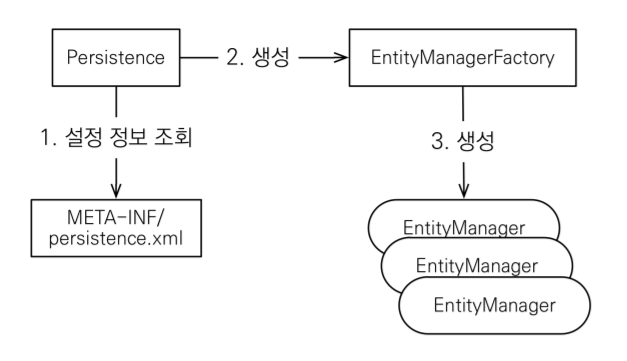
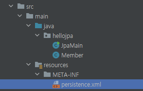
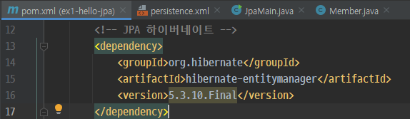

# JPA 시작하기

## 1. JPA 구동 방식




## 2. JPA 환경 설정

JPA를 사용하기 위해서는 우선 설정정보를 등록하고 의존성을 추가하는 과정이 필요하다.



resource 하위에 `META-INF` 디렉토리를 생성하고 persistence.xml을 생성해준다.

```xml
<?xml version="1.0" encoding="UTF-8"?>
<persistence version="2.2"
             xmlns="http://xmlns.jcp.org/xml/ns/persistence" 
             xmlns:xsi="http://www.w3.org/2001/XMLSchema-instance"
             xsi:schemaLocation="http://xmlns.jcp.org/xml/ns/persistence http://xmlns.jcp.org/xml/ns/persistence/persistence_2_2.xsd">
    <persistence-unit name="hello">
        <properties>
            <!-- 필수 속성 -->
            <property name="javax.persistence.jdbc.driver" value="org.h2.Driver"/>
            <property name="javax.persistence.jdbc.user" value="sa"/>
            <property name="javax.persistence.jdbc.password" value=""/>
            <property name="javax.persistence.jdbc.url" value="jdbc:h2:tcp://localhost/~/test"/>
            <property name="hibernate.dialect" value="org.hibernate.dialect.H2Dialect"/>

            <!-- 옵션 -->
            <property name="hibernate.show_sql" value="true"/>
            <property name="hibernate.format_sql" value="true"/>
            <property name="hibernate.use_sql_comments" value="true"/>
            <!--<property name="hibernate.hbm2ddl.auto" value="create" />-->
        </properties>
    </persistence-unit>
</persistence>
```



pom.xml(Maven을 사용 기준)에 hibernate 의존성도 추가해준다.

## 3. CRUD 테스트

```java
public class JpaMain {
    public static void main(String[] args) {
        
        EntityManagerFactory emf = Persistence.createEntityManagerFactory("hello");

        EntityManager em = emf.createEntityManager();

        em.close();

        emf.close();
    }
}
```

* Persistence.createEntityManagerFactory의 인자로 persistenceUnitName를 넘겨주면, 위에서 추가했던 `persistence.xml` 의 정보를 조회하여 `EntityManagerFactory` 객체를 생성할 수 있다.
* `EntityManager`는 내부적으로 database connection을 연결하고 있기 때문에 사용이 종료되면 반드시 close 해줘야한다.
* `EntityManager`는 요청이 있을때마다, 생성이되고, 수행 완료되는 시점에서 close 해야 한다. (쓰레드간에 공유 X)
* `EntityManagerFactory`는 웹서버가 올라오는 시점에서 DB당 1개만 생성되어 애플리케이션 전체에서 공유한다.


```java
public class JpaMain {
    public static void main(String[] args) {
        
        EntityManagerFactory emf = Persistence.createEntityManagerFactory("hello");

        EntityManager em = emf.createEntityManager();

        EntityTransaction tx = em.getTransaction();
        tx.begin(); // transaction 시작

        try {
           // 저장
           Member member = new Member();
           member.setId(2L);
           member.setName("HelloB");
           em.persist(member);

           // 조회
           Member findMember = em.find(Member.class, 1L);
           System.out.println("findMember.id = " + findMember.getId());
           System.out.println("findMember.name = " + findMember.getName());

           // 삭제
           Member findMember = em.find(Member.class, 1L);
           em.remove(findMember);

           // 수정
           Member findMember = em.find(Member.class, 2L);
           findMember.setName("HelloJPA");

           // JPQL을 이용한 조회 예시
           // 실제 물리적인 DB테이블을 대상으로 query를 날려버리면, 
           // 해당 DB에 종속적인 설계가 되어버리는 문제가 있다.
           // 그래서 JPA는 객체를 대상으로 query를 할 수 있는 JPQL이라는 것이 제공되는 것이다. 
           // (SQL을 추상화해서 사용함으로서 특정 데이터베이스 SQL에 의존하지 않는다.)
           List<Member> result = em.createQuery("select m from Member as m", Member.class)
                   .setFirstResult(5) // paging 처리 테스트
                   .setMaxResults(8) // paging 처리 테스트
                   .getResultList();

           for (Member member : result) {
               System.out.println("member.name = " + member.getName());
           }
              
            tx.commit(); // DB에 쿼리 날리는 시점

        } catch (Exception e) {
            tx.rollback(); // 에러 발생시 rollback
        } finally {
           em.close();  // 내부적으로 database connection을 물고 있기 때문에 끝나면 꼭 닫아줘야한다.
        }

        // WAS 가 내려갈때 EntityManagerFactory를 close해줌(connection pool 해제 및 resource 반환)
        emf.close();
    }
}
```

* JPA의 모든 데이터 변경은 트랜잭션 안에서 실행해야 한다.
* `수정` 시 특이사항 : JPA를 통해서 엔티티를 가져오게되면, jpa가 관리를 하게 된다. jpa가 가져온 대상의 변경여부를 transaction 커밋 직전에 체크를하고, 변경점이 있다면, update쿼리를 날리고 transaction 커밋을 한다.


## 참고
[자바 ORM 표준 JPA 프로그래밍 - 기본편](https://www.inflearn.com/course/ORM-JPA-Basic)