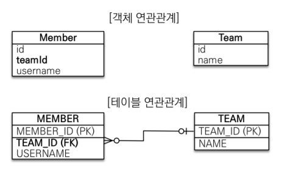
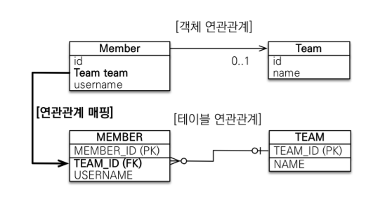
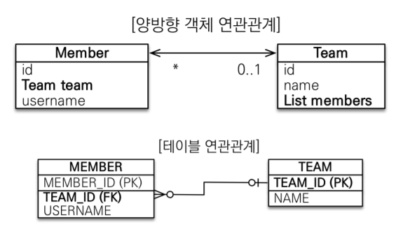
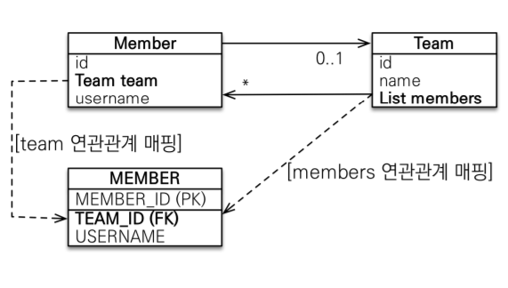
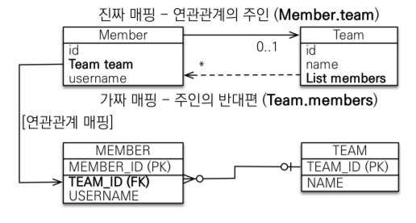
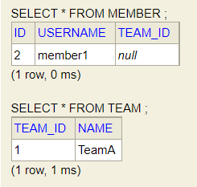
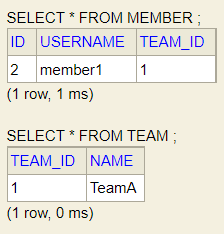
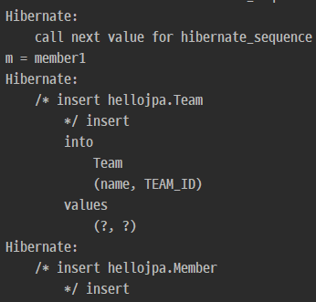

# 연관관계 매핑 


<br><br>


## 1. 연관관계가 필요한 이유

<br>

### 객체를 테이블에 맞추어 데이터 중심으로 모델링하면, 협력관계를 만들 수 없음

* 객체를 테이블에 맞추어 모델링 (연관관계가 없는 객체)

    


* 객체를 테이블에 맞추어 모델링 (참조 대신에 외래 키를 그대로 사용)
    ```java
    @Entity
    public class Member {

        @Id @GeneratedValue
        private Long id;

        @Column(name = "USERNAME", nullable = false)
        private String username;

        @Column(name = "TEAM_ID")
        private Long teamId;

    }
    
    @Entity
    public class Team {

        @Id @GeneratedValue
        @Column(name = "TEAM_ID")
        private Long id;

        private String name;

    }
    ```

* 객체를 테이블에 맞추어 모델링 (외래 키 식별자를 직접 다룸)
    ```java
    public class JpaMain {
        public static void main(String[] args) {
            EntityManagerFactory emf = Persistence.createEntityManagerFactory("hello");
            EntityManager em = emf.createEntityManager();

            EntityTransaction tx = em.getTransaction();
            tx.begin();

            try {
                Team team = new Team();
                team.setName("TeamA");
                em.persist(team); // PK 값이 세팅 되고 영속상태가 됨

                Member member = new Member();
                member.setUsername("member1");
                member.setTeamId(team.getId());
                em.persist(member);
                tx.commit();
            } catch (Exception e) {
                tx.rollback();
            } finally {
                em.close();
            }
            emf.close();
        }
    }
    ```

* 객체를 테이블에 맞추어 모델링 (식별자로 다시 조회, 객체 지향적인 방법은 아님)
    ```java
    Member findMember = em.find(Member.class, member.getId());
    Long findTeamId = findMember.getTeamId();
    Team findTeam = em.find(Team.class, findTeamId);
    ```

* 객체를 테이블에 맞추어 데이터 중심으로 모델링하면, 협력 관계를 만들 수 없음.
  * 테이블은 외래 키로 조인을 사용해서 연관된 테이블을 찾는다.
  * 객체는 참조를 사용해서 연관된 객체를 찾는다.
  * 테이블과 객체 사이에는 이런 큰 간격이 있다.


<br><br>


## 2. 단방향 연관관계

* 객체 지향 모델링 (객체의 참조와 테이블의 외래 키를 매핑)
    ```java
    @Entity
    public class Member {

        @Id @GeneratedValue
        private Long id;

        @Column(name = "USERNAME", nullable = false)
        private String username;

    //    @Column(name = "TEAM_ID")
    //    private Long teamId;

        @ManyToOne
        @JoinColumn(name = "TEAM_ID")
        private Team team;
    }
    ```

* 객체 지향 모델링 (ORM 매핑)

    

    Member 객체에서 Team 객체의 참조값을 가짐

* 객체 지향 모델링 (연관관계 저장)

    ```java
    Team team = new Team();
    team.setName("TeamA");
    em.persist(team); // PK 값이 세팅 되고 영속상태가 됨

    Member member = new Member();
    member.setUsername("member1");
    // member.setTeamId(team.getId());
    member.setTeam(team);
    em.persist(member);

    tx.commit();
    ```

* 객체 지향 모델링 (참조로 연관관계 조회 - 객체 그래프 탐색)
  
    ```java
    Member findMember = em.find(Member.class, member.getId());
    // Long findTeamId = findMember.getTeamId();
    // Team findTeam = em.find(Team.class, findTeamId);
    Team findTeam = findMember.getTeam();
    ```


<br><br>


## 3. 양방향 연관관계와 연관관계의 주인

<br>

### [양방향 매핑]



* 위에 `단방향 연관관계` 예제에서는  Member 객체에서는 getTeam을 통해 Team의 정보를 불러 올 수 있지만,    
  Team 객체에서는 Member 객체의 정보를 조회해 올 수가 없다.
* 하지만, `테이블 연관관계` 측면에서는 FK를 join해서 Team,Member 양쪽에서 서로의 정보를 조회해 올 수가 있다.

```java
@Entity
public class Member {

    @Id @GeneratedValue
    private Long id;

    @Column(name = "USERNAME", nullable = false)
    private String username;

    @ManyToOne
    @JoinColumn(name = "TEAM_ID")
    private Team team;
}

@Entity
public class Team {

    @Id @GeneratedValue
    @Column(name = "TEAM_ID")
    private Long id;

    private String name;

    @OneToMany(mappedBy = "team")
    private List<Member> members = new ArrayList<>();
}
```

양방향 매핑을 하려고 했을때, Member 객체는 단방향과 똑같지만, Team 객체는 새로운 키워드인 `mappedBy`로 Member 객체의 `team` 을 지정하고 있는 것을 확인할 수 있는데, 이로서 **Member 객체가 연관관계의 주인** 이라는 것을 알 수 있다. `mappedBy` 와 `연관관계의 주인` 을 이해하기 위해서는 객체와 테이블이 관계를 맺는 차이부터 이해해야한다.

* 객체와 테이블이 관계를 맺는차이
  * 객체 연관관계 = 2개
    * 회원->팀 연관관계 1개(단방향)
    * 팀 -> 회원 연관관계 1개(단방향)
  * 테이블 연관관계 = 1개

<br>

### 1) 객체의 양방향 관계

    객체의 양방향 관계는 사실 양방향 관계가 아니라 서로 다른 단뱡향 관계 2개다.   
    객체를 양방향으로 참조하려면 단방향 연관관계를 2개 만들어야 한다.

A -> B (a.getB())   
B -> A (b.getA())

```java
class A {
    B b;
}
class B {
    A a;
}
```

<br>

### 2) 테이블의 양방향 연관관계

* 테이블은 외래 키 하나로 두 테이블의 연관관계를 관리
* MEMBER.TEAM_ID 외래 키 하나로 양방향 연관관계 가짐 (양쪽으로 조인할 수 있다.)

```sql
SELECT *
FROM MEMBER M
JOIN TEAM T ON M.TEAM_ID = T.TEAM_ID

SELECT *
FROM TEAM T
JOIN MEMBER M ON T.TEAM_ID = M.TEAM_ID
```

<br>

### 3) 연관관계의 주인(Owner)



#### (1) 양방향 매핑 규칙
* 객체의 두 관계중 하나를 연관관계의 주인으로 지정
* 연관관계의 주인만이 외래 키를 관리(등록, 수정)
* 주인이 아닌쪽은 읽기만 가능
* 주인은 mappedBy 속성 사용X
* 주인이 아니면 mappedBy 속성으로 주인 지정

#### (2) 어느쪽을 주인으로 지정하면 좋은가?
* 외래 키가 있는 있는 곳을 주인으로 정해라
  * 예를 들면, Team에서 List 인 `members` 를 변경하면 update 쿼리는 다른 table인 Member 테이블로 나가게 되는데,    
  이렇게 되면 헷갈릴 소지가 있다.
* 위 예제 코드에서는 Member.team이 연관관계의 주인  
    
* N:1 관계에서는 N쪽이 주인으로 지정하면 된다.(FK가 있는 Entity)

<br>

### 4) 양방향 매핑시 가장 많이 하는 실수 (연관관계의 주인에 값을 입력하지 않음)

```java
Team team = new Team();
team.setName("TeamA");
em.persist(team);

Member member = new Member();
member.setUsername("member1");
em.persist(member);

team.getMembers().add(member);

tx.commit();

```



주인에 reference값을 세팅해주지 않으면, DB에 null 값이 들어가게 된다.

```java
Team team = new Team();
team.setName("TeamA");
em.persist(team);

Member member = new Member();
member.setUsername("member1");
member.setTeam(team);  // 연관관계의 주인에 값 세팅
em.persist(member);

// team.getMembers().add(member);  // 주인이 아닌 쪽은 읽기전용으로 set을 해줘도 JPA가 DB에 쿼리를 날리지 않는다.

tx.commit();
```



주인에 reference값을 세팅해주어야 테이블에 TEAM_ID가 들어간 것을 확인 할 수 있다.

하지만, 객체지향의 관점에서는 주인에만 값을 넣는게 아니라, 양쪽에 다 넣어주는 것이 좋다.

```java
Team team = new Team();
team.setName("TeamA");
em.persist(team);

Member member = new Member();
member.setUsername("member1");
member.setTeam(team);  // 주인에 값을 세팅
em.persist(member);

// team.getMembers().add(member);

// em.flush();
// em.clear();

Team findTeam = em.find(Team.class, team.getId());
List<Member> members = findTeam.getMembers();
for (Member m : members) {
    System.out.println("m = " + m.getUsername());
}
```

위의 코드는 주인에만 값을 넣은 코드이고, 이를 실행시키면, `members.size()` 가 0이 되게 된다.    
`em.flush()`와 `em.clear()`의 주석을 해제하면, `em.find(Team.class, team.getId())` 에서 select 쿼리가 나가지만,   
간단히 주인이 아닌 쪽에 값을 새팅하게 되면 `em.flush()` 를 하지 않아도, 즉각적으로 원하는 값을 **1차 캐시**에서 조회할 수 있다.

```java:Member.java
Member member = new Member();
member.setUsername("member1");
member.setTeam(team);
em.persist(member);

team.getMembers().add(member);  // 주인이 아닌쪽에도 값 세팅
```



`flush()` 없이도, 출력 결과를 확인 할 수 있다. ( `m = member1` )

양쪽에 다 값을 넣어주게 되면, 테스트시에도 JPA의 기능들을 활용하지 않고서도 값이 제대로 들어갔는지를 검증할 수 있기 때문에, 항상 양쪽에 값을 다 넣어주는 것이 맞다고 할 수 있다.

```java
public void changeTeam(Team team) {
    this.team = team;
    team.getMembers().add(this);
}
```

코드 가독성을 위해 Member 객체의 setTeam 메소드에서`(주인인 쪽에 값 세팅을 할때)` member 리스트에 값을 추가하면 `(주인이 아닌쪽에 값 세팅)` 더 깔끔한 코드가 된다. 메소드 이름도 목적에 맞는 구체적인 이름으로 변경해주는게 좋다(**연관관계 편의 메소드**).

#### 양방향 매핑 정리
* 단방향 매핑만으로도 이미 연관관계 매핑은 완료
* 양방향 매핑은 반대 방향으로 조회(객체 그래프 탐색) 기능이 추가된 것 뿐
* JPQL에서 역방향으로 탐색할 일이 많음
* 단방향 매핑을 잘 하고 양방향은 필요할 때 추가해도 됨 (테이블에 영향을 주지 않음)
* 비즈니스 로직을 기준으로 연관관계의 주인을 선택하면 안됨
* 연관관계의 주인은 외래 키의 위치를 기준으로 정해야함


<br><br>


<br><br>


## 참고
[자바 ORM 표준 JPA 프로그래밍 - 기본편](https://www.inflearn.com/course/ORM-JPA-Basic)