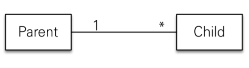
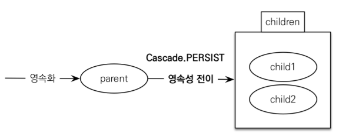
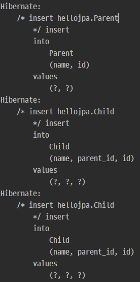
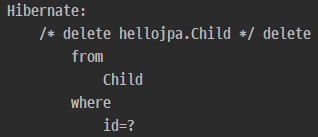

# 영속성 전이(CASCADE) 와 고아(ORPHAN) 객체

## 1. 영속성 전이(CASCADE)
* 특정 엔티티를 영속 상태로 만들때 관련된 엔티티도 함께 영속 상태로 만들고 싶을 때 사용
  예) 부모 엔티티를 저장할 때 자식 엔티티도 함께 저장.   

    

<br>

### 1) 저장

```java
@OneToMany(mappedBy = "parent", cascade = CascadeType.ALL)
private List<Child> children = new ArrayList<>();
```




```java
Child child1 = new Child();
Child child2 = new Child();

Parent parent = new Parent();
parent.addChild(child1);
parent.addChild(child2);

em.persist(parent);
// em.persist(child1);
// em.persist(child2);

tx.commit();
```

cascade 를 Parent 엔티티에 설정 후 Parent 엔티티만 persist 해도 Child 엔티티가 같이 저장되는 것을 확인할 수 있다.



<br>

### 2) 영속성 전이: CASCADE - 주의!

* 영속성 전이는 연관관계를 매핑하는 것과 아무 관련이 없음
* 엔티티를 영속화할 때 연관된 엔티티도 함께 영속화하는 편리함을 제공할 뿐
* **다른 엔티티에서도 cascade에 대상이 되는 객체를 연관관계 매핑 등을 통하여 사용할때는 cascade를 사용하면 안 된다.**

<br>

### 3) CASCADE의 종류

* ALL: 모두 적용
* PERSIST: 영속
* REMOVE: 삭제
* MERGE: 병합
* REFRESH: REFRESH
* DETACH: DETACH


<br><br>


## 2. 고아(ORPHAN) 객체

* 참조가 제거된 엔티티는 다른 곳에서 참조하지 않는 고아 객체로 보고 삭제하는 기능
* 참조하는 곳이 하나일 때 사용해야함!
* 특정 엔티티가 개인 소유할 때 사용
* @OneToOne, @OneToMany만 가능
* 참고: 개념적으로 부모를 제거하면 자식은 고아가 된다. 따라서 고아 객체 제거 기능을 활성화 하면, 부모를 제거할 때 자식도 함께 제거된다. 이것은 CascadeType.REMOVE처럼 동작한다.

```java
/* Parent.java */

@OneToMany(mappedBy = "parent", cascade = CascadeType.ALL, orphanRemoval = true)
private List<Child> childList = new ArrayList<>();
```

```java
/* JpaMain.java */

Child child1 = new Child();
Child child2 = new Child();

Parent parent = new Parent();
parent.addChild(child1);
parent.addChild(child2);

em.persist(parent);
// em.persist(child1);
// em.persist(child2);

em.flush();
em.clear();

Parent findParent = em.find(Parent.class, parent.getId());
findParent.getChildList().remove(0);  // 컬렉션에서 제거를 하면 DB에도 delete 쿼리가 나간다.
```




<br><br>


## 3. 영속성 전이 + 고아 객체, 생명주기

* CascadeType.ALL + orphanRemovel=true
* 스스로 생명주기를 관리하는 엔티티는 em.persist()로 영속화, em.remove()로 제거
* 두 옵션을 모두 활성화 하면 부모 엔티티를 통해서 자식의 생명주기를 관리할 수 있음
<!-- * 도메인 주도 설계(DDD)의 Aggregate Root개념을 구현할 때 유용 -->   
<!-- 추후 학습 후 완전히 이해되면 주석해재할것 -->


<br><br>


## 참고
[자바 ORM 표준 JPA 프로그래밍 - 기본편](https://www.inflearn.com/course/ORM-JPA-Basic)