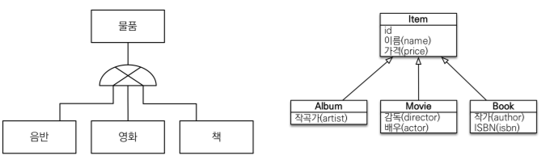

# 상속관계 매핑
 * 관계형 DB는 상속을 지원하지 않는다. 하지만 슈퍼타입 서브타입 관계라는 모델링 기법이 있는데, 이는 객체 상속과 유사하다.
 * 상속관계 매핑이란? 객체의 상속과 구조와 DB의 슈퍼타입 서브타입 관계를 매핑하는 것   
        
 * 슈퍼타입 서브타입 논리 모델을 실제 물리 모델로 구현하는 방법에는 크게 3가지가 있다.
   1) 각각 테이블로 변환 -> 조인 전략
   2)  통합 테이블로 변환 -> 단일 테이블 전략
   3)  서브타입 테이블로 변환 -> 구현 클래스마다 테이블 전략

  

## 1. 주요 어노테이션

  

## 2. 조인 전략

  

## 3. 단일 테이블 전략

## 4. 구현 클래스마다 테이블 전략

  

## 참고
[자바 ORM 표준 JPA 프로그래밍 - 기본편](https://www.inflearn.com/course/ORM-JPA-Basic)