# 값 타입

## JPA의 최상위 데이터 타입 분류

* 엔티티 타입
  * @Entity로 정의하는 객체
  * 데이터가 변해도 식별자로 지속해서 추적 가능
  * 예) 회원 엔티티의 키나 나이 값을 변경해도 식별자로 인식 가능
* 값 타입
  * int, Integer, String처럼 단순히 값으로 사용하는 자바 기본 타입이나 객체
  * 식별자가 없고 값만 있으므로 변경시 추적 불가
  * 예) 숫자 100을 200으로 변경하면 완전히 다른 값으로 대체


<br><br>


## 값 타입 분류

* 기본값 타입
  * 자바 기본 타입(int, double)
  * 래퍼 클래스(Integer, Long)
  * String
* 임베디드 타입(embedded type, 복합 값 타입)
  * JPA에서 정의해서 사용해야함
  * 예) 좌표같은 경우, Position Class 를 만들어서 사용 할 수 있다
* 컬렉션 값 타입(collection value type)
  * JPA에서 정의해서 사용해야함
  * java 컬렉션에 기본 값 타입이나 임베디드 타입을 넣은 형태


<br><br>


## 1. 기본값 타입

* 예): String name, int age

* 생명주기를 엔티티의 의존   
  예) 회원을 삭제하면 이름, 나이 필드도 함께 삭제

* 값 타입은 공유하면X (부수효과(side effect)가 일어나면 안되기 때문에)   
  예) 회원 이름 변경시 다른 회원의 이름도 함께 변경되면 안됨

* 참고: 자바의 기본 타입은 절대 공유X
  * int, double 같은 기본 타입(primitive type)은 절대 공유X
  * 기본 타입은 항상 값을 복사함
    ```java
    int a = 10;
    int b = a;  // a의 값이 b로 복사가 됨

    a = 20;  // a에 20을 할당해도, 이미 b는 기존의 a의 값이 복사가 되어버렸기 때문에 b값의 변화는 없다.

    System.out.println("a = " + a);  // 출력결과 : a = 20
    System.out.println("b = " + b);  // 출력결과 : b = 10
    ```
  * Integer같은 래퍼 클래스나 String 같은 특수한 클래스는 공유 가능한 객체이지만 변경X


<br><br>


## 2. 임베디드 타입

* 새로운 값 타입을 직접 정의할 수 있음
* JPA는 임베디드 타입(embedded type)이라 함
* 주로 기본 값 타입을 모아서 만들어서 복합 값 타입이라고도 함
* int, String과 같은 값 타입

<br>

### 1) 예시
* 회원 엔티티는 이름, 근무 시작일, 근무 종료일, 주소 도시, 주소번지, 주소 우편번호를 가진다.
* 실생활에서는 회원 엔티티는 이름, 근무 기간, 집 주소를 가진다. 라고 공통되는 부분을 묶어서 언급한다. -> 임베디드 타입이 이런 역할을 해줄 수 있다.

<br>

### 2) 사용법
* @Embeddable: 값 타입을 정의하는 곳에 표시
* @Embedded: 값 타입을 사용하는 곳에 표시
* 기본 생성자 필수

<br>

### 3) 장점
* 높은 재사용성
* 높은 응집도
* Period.isWork()처럼 해당 값 타입만 사용하는 의미 있는 메소드를 만들 수 있음
  * 객체지향적인 설계 용이
* 임베디드 타입을 포함한 모든 값 타입은, 값 타입을 소유한 엔티티에 생명주기를 의존함

<br>

### 4) 임베디드 타입과 테이블 매핑

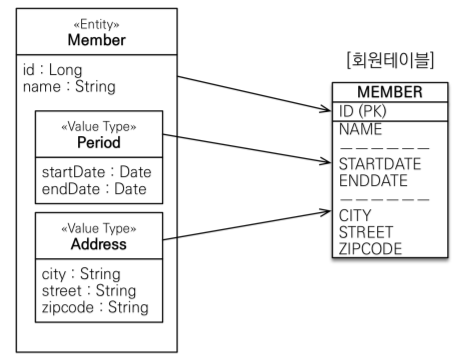

* 임베디드 타입은 엔티티의 값일 뿐이다.
* 임베디드 타입을 사용하기 전과 후에 **매핑하는 테이블은 같다**.
* 객체와 테이블을 아주 세밀하게(find-grained) 매핑하는 것이 가능
* 잘 설계한 ORM 애플리케이션은 매핑한 테이블의 수보다 클래스의 수가 더 많음
* 임베디드 타입의 값이 null이면 매핑한 컬럼 값은 모두 null

```java
@Entity
public class Member {

    @Id
    @GeneratedValue
    @Column(name = "MEMBER_ID")
    private Long id;

    @Column(name = "USERNAME", nullable = false)
    private String username;

    // 기간
    @Embedded
    private Period workPeriod;

    // 주소
    @Embedded
    private Address homeAddress;
}
```

```java
@Embeddable
public class Address {
    private String city;
    private String street;
    private String zipcode;

    /*getter setter 생략*/
}
```
```java
@Embeddable
public class Period {
    private LocalDateTime startDate;
    private LocalDateTime endDAte;

    public boolean isWork() {
        // 필요한 로직 추가
    }

    /*getter setter 생략*/
}
```

```java
/* JpaMain.java */

Member member = new Member();
member.setUsername("hello");
member.setHomeAddress(new Address("city", "street", "100"));
// member.setWorkPeriod(new Period());

em.persist(member);

tx.commit();
```

<br>

### 5) 임베디드 타입과 연관관계

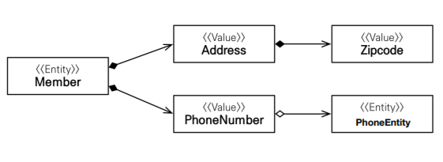

* 임베디드 타입은 임베디드 값을 가질 수 있다.
* 임베디드 타입은 엔티티 타입도 가질 수 있다.(FK를 가지는 방식으로)
* 한 엔티티에서 같은 값 타입을 사용하면 중복 문제가 발생 할 수 있다
    ```java
    public class Member {
        ...

        // 주소
        @Embedded
        private Address homeAddress;

        // 주소
        @Embedded
        private Address workAddress;

        ...
    }
    ```
    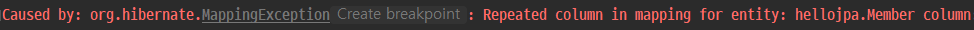

  * `@AttributeOverrides`, `@AttributeOverride`를 사용하여 컬럼명 속성을 재정의 할 수 있다.

    ```java
    public class Member {
        ...

        // 주소
        @Embedded
        private Address homeAddress;

        // 주소
        @Embedded
        @AttributeOverrides({
                @AttributeOverride(name = "city", column = @Column(name = "WORK_CITY")),
                @AttributeOverride(name = "street", column = @Column(name = "WORK_STREET")),
                @AttributeOverride(name = "zipcode", column = @Column(name = "WORK_ZIPCODE"))
        })
        private Address workAddress;

        ...
    }
    ```

    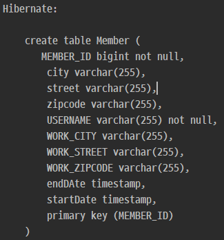

<br>

### 6) 값 타입과 불변 객체
* 값 타입은 복잡한 객체 세상을 조금이라도 단순화하려고 만든 개념이다. 
* 따라서 값 타입은 단순하고 안전하게 다룰 수 있어야 한다.

#### (1) 값 타입 공유 참조
* 임베디드 타입 같은 값 타입을 여러 엔티티에서 공유하면 위험함
* 부작용(side effect) 발생  
    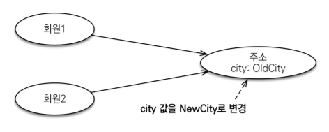

    ```java
    /* JpaMain.java */

    Address address = new Address("city", "street", "100");

    Member member = new Member();
    member.setUsername("member1");
    member.setHomeAddress(address);
    em.persist(member);

    Member member2 = new Member();
    member2.setUsername("member2");
    member2.setHomeAddress(address);
    em.persist(member2);

    tx.commit();
    ```

    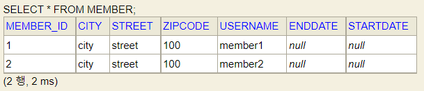

    ```java
    ...
    
    member.getHomeAddress().setCity("newCity");

    tx.commit();
    ```
    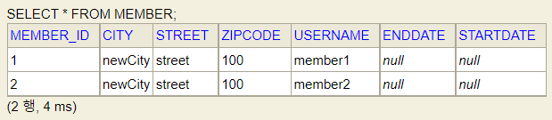

* update 쿼리가 두 번 나가서 두 객체 모두의 값이 변경 되는 원치 않는 결과를 얻게된다.
* 엔티티간의 값을 모두 공유해서 사용하고자 할때는 값 타입이 아니라 엔티티로 만들어야 한다.

#### (2) 값 타입 복사
* 값 타입의 실제 인스턴스인 값을 공유하는 것은 위험
* 대신 값(인스턴스)를 복사해서 사용   
    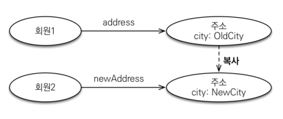

    ```java
    /* JpaMain.java */

    Address address = new Address("city", "street", "100");

    Member member = new Member();
    member.setUsername("member1");
    member.setHomeAddress(address);
    em.persist(member);

    Address copyAddress = new Address(address.getCity(), address.getStreet(), address.getZipcode());

    Member member2 = new Member();
    member2.setUsername("member2");
    member2.setHomeAddress(copyAddress);
    em.persist(member2);

    member.getHomeAddress().setCity("newCity");

    tx.commit();
    ```

    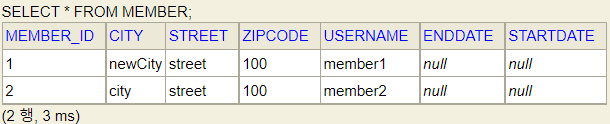

#### (3) 객체 타입의 한계

* 항상 값을 복사해서 사용하면 공유 참조로 인해 발생하는 부작용을 피할 수 있다.
* 문제는 임베디드 타입처럼 직접 정의한 값 타입은 자바의 기본타입이 아니라 객체 타입이다.
* 자바 기본 타입에 값을 대입하면 값을 복사한다.
* 객체 타입은 참조 값을 직접 대입하는 것을 막을 방법이 없다.
* 객체의 공유 참조는 피할 수 없다

#### (4) 불변 객체

* 객체 타입을 수정할 수 없게 만들면 부작용을 원천 차단
* 값 타입은 불변 객체(immutable object)로 설계해야함
* 불변 객체: 생성 시점 이후 절대 값을 변경할 수 없는 객체
* 생성자로만 값을 설정하고 수정자(Setter)를 만들지 않으면 됨
* 참고: Integer, String은 자바가 제공하는 대표적인 불변 객체
* 불변이라는 작은 제약으로 부작용이라는 큰 재앙을 막을 수 있다
* 예제 코드의 Member 객체의 경우는 setter를 없애던가 private 으로 변경하여 불변객체를 만들 수 있다
* 불변객체로 만들면 새로운 객체에 값을 할당할때는 참조값을 건드는 것이 아니라 새로 생성하여 넣어야 한다.

    ```java
    /* JpaMain.java */

    Address address = new Address("city", "street", "100");

    Member member = new Member();
    member.setUsername("member1");
    member.setHomeAddress(address);
    em.persist(member);

    Address newAddress = new Address("changedCity", address.getStreet(), address.getZipcode());

    Member member2 = new Member();
    member2.setUsername("member2");
    member2.setHomeAddress(newAddress);
    em.persist(member2);
    ```

#### (5) 값 타입의 비교

* 동일성(identity) 비교: 인스턴스의 참조 값을 비교, == 사용
* 동등성(equivalence) 비교: 인스턴스의 값을 비교, equals() 사용
* 값 타입은 a.equals(b)를 사용해서 동등성 비교를 해야 함
    ```java
    int a = 10;
    int b = 10;

    System.out.println("a == b : " + (a == b));  // true

    Address address1 = new Address("city", "street", "100");
    Address address2 = new Address("city", "street", "100");

    System.out.println("address1 == address2 : " + (address1 == address2));  // false
    System.out.println("address1 equals address2 : " + (address1.equals(address2))); // override 하기전에는 false가 반환 equals를 override해줘야 true 반환
    ```

* 값 타입의 equals() 메소드를 적절하게 재정의(주로 모든 필드 사용)
  * equals를 재정이할때는 웬만하면 IDE에서 기본으로 제공해주는 방식대로 생성한다.
    ```java
    @Override
    public boolean equals(Object o) {
        if (this == o) return true;
        if (o == null || getClass() != o.getClass()) return false;
        Address address = (Address) o;
        return Objects.equals(city, address.city) && Objects.equals(street, address.street) && Objects.equals(zipcode, address.zipcode);
    }

    @Override
    public int hashCode() {
        return Objects.hash(city, street, zipcode);
    }
    ```
  * equals를 생성할때는 hashCode()도 같이 재정의해 준다.


<br><br>


## 3. 값 타입 컬렉션

* 값 타입을 컬렉션에 넣어서 사용하는 것을 말한다.
* 값 타입을 하나 이상 저장할 때 사용
* 데이터베이스는 컬렉션을 같은 테이블에 저장할 수 없다.
  * RDB는 내부적으로 컬렉션을 담을 수 있는 구조가 아니다. (value 로 값만 넣을 수 있음)
  * 컬렉션을 저장하기 위한 별도의 테이블이 필요함
* @ElementCollection, @CollectionTable 사용

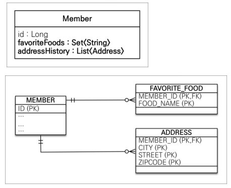
* `FAVORITE_FOOD` 와 `ADDRESS` 에서 모든 컬럼을 묶어서 PK로 지정하는 이유는, 별도의 식별자(id) 를 넣어서 PK로 쓰게되면, 그것은 값 타입이 아니고 엔티티가 되어버린다.    
따라서, 테이블에는 값들만 저장을 하고 이들을 모두 묶어서 PK로 지정하여 사용한다.


```java
/* Member.java */

...

@Embedded
private Address homeAddress;

@ElementCollection
@CollectionTable(name = "FAVORITE_FOOD",
        joinColumns = @JoinColumn(name = "MEMBER_ID")
)
@Column(name = "FOOD_NAME")  // AddressList 와는 달리 값이 하나고 정의한 값이 아니기 때문에 이 시점에 변경 가능
private Set<String> favoriteFoods = new HashSet<>();

@ElementCollection
@CollectionTable(name = "ADDRESS",
        joinColumns = @JoinColumn(name = "MEMBER_ID")
)
private List<Address> addressHistory = new ArrayList<>();

...
```

```java
@Embeddable
public class Address {
    private String city;
    private String street;
//    @Column(name = "ZIPCODE")
    private String zipcode;

...
```

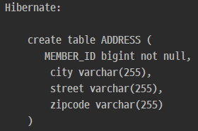
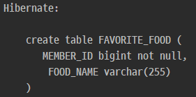

<br>

### 1) 값 타입 컬렉션 저장

```java
/* JpaMain.java */

Member member = new Member();
member.setUsername("member1");
member.setHomeAddress(new Address("homeCity", "street", "10000"));

member.getFavoriteFoods().add("치킨");
member.getFavoriteFoods().add("족발");
member.getFavoriteFoods().add("피자");

member.getAddressHistory().add(new Address("old1", "street", "10000"));
member.getAddressHistory().add(new Address("old2", "street", "10000"));

em.persist(member);

tx.commit();
```

* 제일 먼저 MEMBER 저장 쿼리 1개가 실행되고,   
  그 후로  ADDRESS 저장 쿼리 2개, FAVORITE_FOOD 저장 쿼리 3개가 실행 된다.
* persist(member)만 했는데도 Address와, FavoriteFood에 대한 저장 쿼리도 실행 되었는데,   
  이는 Address와, FavoriteFood 가 **값 타입이기 때문이다.**
  Member에 소속된 값 타입들은 당연히 별도의 생명주기가 없이 Member의 라이프사이클에 의존한다.
* 변경이 필요할때도 그냥 Member 객체에서 값을 변경하면 적용이 된다.
* 1:N 연관 관계에서 `Cascade=ALL`로 설정하고, `orphanRemoval=true` 로 설정한 것과 비슷하다.
* 참고: 값 타입 컬렉션은 영속성 전에(Cascade) + 고아 객체 제거 기능을 필수로 가진다고 볼 수 있다.

<br>

### 2) 값 타입 컬렉션 조회

```java
/* JpaMain.java */

... // 바로 위 예제코드와 동일

em.persist(member);
em.flush();
em.clear();

System.out.println("===================   START   ===================");
Member findMember = em.find(Member.class, member.getId());

tx.commit();
```

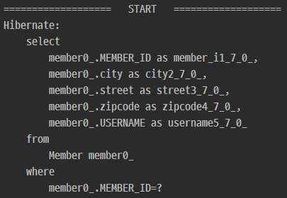

* 조회를 해보면 임베디드 타입인 `homeAddress` 까지는 같이 조회가 되나, 컬렉션 타입들은 같이 조회가 되지 않는다.    
  -> 이로서 컬렉션 값 타입들은 **지연로딩** 되는 것을 알 수 있다.

```java
/* JpaMain.java */

...

System.out.println("===================   START   ===================");
Member findMember = em.find(Member.class, member.getId());

List<Address> addressHistory = findMember.getAddressHistory();
for (Address address : addressHistory) {
    System.out.println("address = " + address.getCity());
}

Set<String> favoriteFoods = findMember.getFavoriteFoods();
for (String favoriteFood : favoriteFoods) {
    System.out.println("favoriteFood = " + favoriteFood);
}

tx.commit();
```

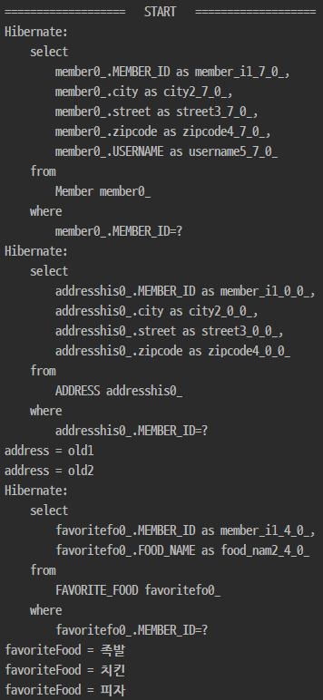

* DB에서 값을 가져와야할 시점에 쿼리가 실행되는 것을 확인할 수 있다.

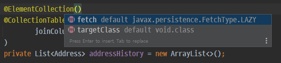

* `@ElementCollection` 은 기본값이 `fetchType.LAZY` 인 것을 확인할 수 있다.

<br>

### 3) 값 타입 컬렉션 수정

```java
/* JpaMain.java */

...

System.out.println("===================   START   ===================");
Member findMember = em.find(Member.class, member.getId());

// homeCity -> newCity
// findMember.getHomeAddress().setCity("newCity");  // 잘못된 방법
Address a = findMember.getHomeAddress();
findMember.setHomeAddress(new Address("newCity", a.getStreet(), a.getZipcode())); // 통으로 갈아끼워 넣어야한다.

tx.commit();
```

* 값 타입은 기본적으로 불변(immutable) 객체여야 한다.
* 수정이 불가하니 필요하다면 통으로 갈아 끼워넣어야한다.

#### (1) `Set<String> favoriteFoods` 수정

```java
/* JpaMain.java */

... // 위 예제코드와 동일

// 치킨 -> 한식
findMember.getFavoriteFoods().remove("치킨");
findMember.getFavoriteFoods().add("한식");

tx.commit();
```

* String 역시 값 타입 으로서 불변 객체이므로 수정이 불가하다. 값을 바꾸려면 `삭제->추가` 과정이 필요하다.

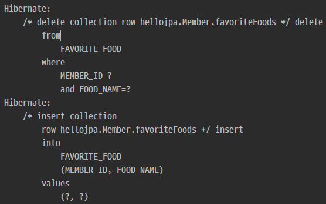

* 컬렉션의 값만 변경해도 실제 DB에 update 쿼리가 나간다. (CASCADE 처럼)
* 값 타입 컬렉션들은 엔티티에 의존관계를 맡긴다.(엔티티 소속의 단순한 값일 뿐이다)

#### (2) `List<Address> addressHistory` 수정

```java
/* JpaMain.java */

... // 위 예제코드와 동일

// remove할 대상을 찾을때 equals로 찾는다. 그래서 equals와 hashcode가 제대로 구현이 되어 있지 않으면 망한다..
findMember.getAddressHistory().remove(new Address("old1", "street", "10000"));
findMember.getAddressHistory().add(new Address("newCity1", "street", "10000"));

tx.commit();
```

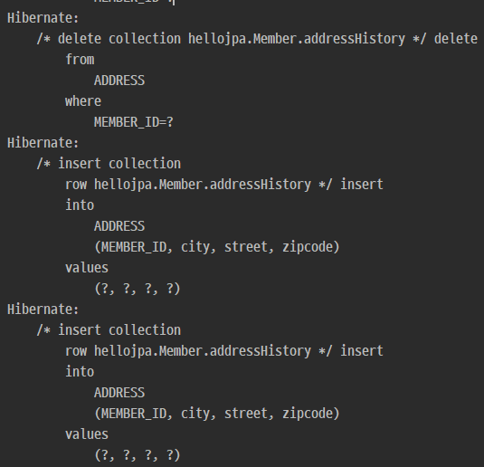

* Address 테이블에서 해당 `MEMBER_ID`로 등록이 된 데이터를 모두 지우고,    
  `.add` 한 데이터와 `.remove`에 대상이 아니었던 데이터들을 insert하는 것을 확인할 수 있다.   
  (아래 `값 타입 컬렉션의 제약사항` 3번째 항목 참고)

#### (3) 값 타입 컬렉션의 제약사항

* 값 타입은 엔티티와 다르게 식별자 개념이 없다.
* 값은 변경하면 추적이 어렵다.
* 값 타입 컬렉션에 변경 사항이 발생하면, 주인 엔티티와 연관된 모든 데이터를 삭제하고, 값 타입 컬렉션에 있는 현재 값을 모두 다시 저장한다.   
  (**실무에서 쓰기 위험한 point**)
  * @OrderColumn(name = "address_history_order") 를 추가해주면 업데이트 query를 날릴 수 있지만, 의도한 대로 동작하지 않을 경우가 있다.
    ```java
    @OrderColumn(name = "address_history_order")
    @ElementCollection()
    @CollectionTable(name = "ADDRESS",
            joinColumns = @JoinColumn(name = "MEMBER_ID")
    )
    private List<Address> addressHistory = new ArrayList<>();
    ```
    ```sql
    create table ADDRESS (
       MEMBER_ID bigint not null,
        city varchar(255),
        street varchar(255),
        zipcode varchar(255),
        address_history_order integer not null,
        primary key (MEMBER_ID, address_history_order)
    )
    ```
    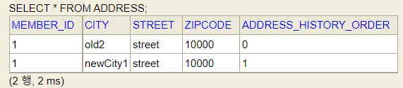
    * 식별자도 추가되고 pk도 제대로 잡지만, 의도한대로 동작하지 않을 경우가 많고,   
      null이 식별자로 들어가는 경우도 있기 때문에, 문제가 복잡해진다.

* 값 타입 컬렉션을 매핑하는 테이블은 모든 컬럼을 묶어서 기본키를 구성해야 함: null 입력X, 중복 저장X

#### (4) 값 타입 컬렉션의 대안

* 실무에서는 상황에 따라 값 타입 컬렉션 대신에 일대다 관계를 고려
* 일대다 관계를 위한 엔티티를 만들고, 여기에서 값 타입을 사용
* 영속성 전이(Cascade) + 고아 객체 제거를 사용해서 값 타입 컬렉션 처럼 사용
* 엔티티로 만드는게 실무에서 쿼리 최적화에 유리한 점도 있다
* 값 타입 컬렉션을 사용하는 경우는, 매우 단순하고 추적이 필요없는 상황, 값이 바뀌어도 update 할 필요가 없을 때 사용한다.
  * 예)select 박스에서 치킨,피자,... 을 멀티select할 경우
* EX) AddressEntity

#### [수정된 코드]

```java
/* Member.java */

...

/*
//    @OrderColumn(name = "address_history_order")
    @ElementCollection()
    @CollectionTable(name = "ADDRESS",
            joinColumns = @JoinColumn(name = "MEMBER_ID")
    )
    private List<Address> addressHistory = new ArrayList<>();
*/

@OneToMany(cascade = CascadeType.ALL, orphanRemoval = true)
@JoinColumn(name = "MEMBER_ID")
private List<AddressEntity> addressHistory = new ArrayList<>();

...
```

```java
@Entity
@Table(name = "ADDRESS")
public class AddressEntity {
    @Id
    @GeneratedValue
    private Long id;

    private Address address;

...
```

```java
/* JpaMain.java */

...

Member member = new Member();
member.setUsername("member1");
member.setHomeAddress(new Address("homeCity", "street", "10000"));

member.getFavoriteFoods().add("치킨");
member.getFavoriteFoods().add("족발");
member.getFavoriteFoods().add("피자");

// member.getAddressHistory().add(new Address("old1", "street", "10000"));
// member.getAddressHistory().add(new Address("old2", "street", "10000"));

member.getAddressHistory().add(new AddressEntity("old1", "street", "10000"));
member.getAddressHistory().add(new AddressEntity("old2", "street", "10000"));

em.persist(member);
em.flush();
em.clear();

tx.commit();
...
```

```sql
Hibernate: 
    /* insert hellojpa.AddressEntity
        */ insert 
        into
            ADDRESS
            (city, street, zipcode, id) 
        values
            (?, ?, ?, ?)
Hibernate: 
    /* insert hellojpa.AddressEntity
        */ insert 
        into
            ADDRESS
            (city, street, zipcode, id) 
        values
            (?, ?, ?, ?)
Hibernate: 
    /* create one-to-many row hellojpa.Member.addressHistory */ update
        ADDRESS 
    set
        MEMBER_ID=? 
    where
        id=?
Hibernate: 
    /* create one-to-many row hellojpa.Member.addressHistory */ update
        ADDRESS 
    set
        MEMBER_ID=? 
    where
        id=?
```
* update쿼리가 나가는 것은 외래키가 다른 테이블에 있기 때문에 일대다 단방향 맵핑에서는 어쩔 수 없는 것

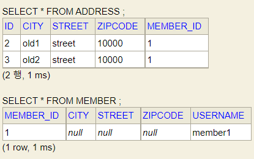

* ADDRESS 테이블에 자체적인 식별자가 있다는 것은 엔티티라는 것이고, 값을 가져와서 마음대로 수정할 수 있다.
* 이렇게 값타입을 엔티티로 변경하는 것을 `값타입을 엔티티로 승급화` 한다 라고 한다.

#### (5) 정리

* 엔티티 타입의 특징
    * 식별자O
    * 생명 주기 관리
    * 공유
* 값 타입의 특징
    * 식별자X
    * 생명 주기를 엔티티에 의존
    * 공유하지 않는 것이 안전(복사해서 사용)
    * 불변 객체로 만드는 것이 안전
* 값 타입은 정말 값 타입이라 판단될 때만 사용
* 엔티티와 값 타입을 혼동해서 엔티티를 값 타입으로 만들면 안됨
* 식별자가 필요하고, 지속해서 값을 추적, 변경해야 한다면 그것은 값 타입이 아닌 엔티티
<br><br>


## 참고
[자바 ORM 표준 JPA 프로그래밍 - 기본편](https://www.inflearn.com/course/ORM-JPA-Basic)