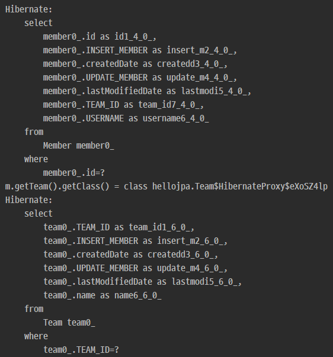

# 즉시 로딩과 지연 로딩

## 1. 지연 로딩 LAZY을 사용해서 프록시로 조회
* 단순히 Member 정보만 조회할때에는 Member가 속해 있는 Team객체의 정보까지 불러 올 필요는 없다.   
  이럴 상황에서는, 지연 로딩을 통해 필요한 데이터만 select 해 오는 것이 성능상으로 이점이 많다.   
  `fetch = FetchType.LAZY` 를 사용하여 지연로딩으로 설정해준다.

    ```java
    @Entity
    public class Member extends BaseEntity {

    @Id @GeneratedValue
    private Long id;

    @Column(name = "USERNAME", nullable = false)
    private String username;

    @ManyToOne(fetch = FetchType.LAZY)
    @JoinColumn(name = "TEAM_ID")
    private Team team;
    ```

    

* DB에서 정보를 가지고 와야 하는 시점에 `team`을 조회해오는 query가 실행된다

    


    ```java
    public class JpaMain {
    public static void main(String[] args) {
        EntityManagerFactory emf = Persistence.createEntityManagerFactory("hello");
        EntityManager em = emf.createEntityManager();

        EntityTransaction tx = em.getTransaction();
        tx.begin();

        try {
            Team team = new Team();
            team.setName("teamA");
            em.persist(team);

            Member member1 = new Member();
            member1.setUsername("member1");
            member1.setTeam(team);

            em.persist(member1);

            em.flush();
            em.clear();

            Member m = em.find(Member.class, member1.getId());  // `Member`에 한해 select 쿼리 실행

            System.out.println("m.getTeam().getClass() = " + m.getTeam().getClass());

            m.getTeam().getName();  // lazyLoading시 초기화 실행시점 (`Team`에 대한 select 쿼리가 실행되는 시점)

            tx.commit();
        } catch (Exception e) {
            tx.rollback();
            e.printStackTrace();
        } finally {
           em.close();  
        }
        emf.close();
    }

    ```

    


<br><br>


## 2. 즉시 로딩 EAGER을 사용해서 조회

* Member 엔티티를 조회 후 대부분의 경우에서 team 엔티티의 정보를 같이 활용해야 하는 경우에는   
 **즉시로딩** 을 활용하는 것이 성능상의 이점이 많다.
    

* 즉시 로딩(EAGER)으로 설정하면, Member조회시 항상 Team도 조회한다
    

* Member 엔티티의 Team 컬럼에서 `@ManyToOne(fetch = FetchType.EAGER)`으로 설정해준다.
    ```java
    @ManyToOne(fetch = FetchType.EAGER)
    @JoinColumn(name = "TEAM_ID")
    private Team team;
    ```

* join을 통해 데이터를 한꺼번에 조회해오는 것을 확인할 수 있으며,   
  Team객체도 proxy객체가 아닌 진자 객체를 불러 오는 것을 확인할 수 있다.
    


<br><br>


## 3. 프록시와 즉시로딩 주의점

* 가급적 지연 로딩만 사용(특히 실무에서)
* 즉시 로딩을 적용하면 예상하지 못한 SQL이 발생
* 즉시 로딩은 JPQL에서 N+1 문제를 일으킨다.
* @ManyToOne, @OneToOne은 기본이 즉시 로딩 -> LAZY로 설정
* @OneToMany, @ManyToMany는 기본이 지연 로딩


<br><br>


## 4. 지연 로딩 활용(이론 상일 뿐, 실무에서는 대부분 지연로딩으로 세팅 해야함)

* Member와 Team은 자주 함께 사용 -> 즉시 로딩
* Member와 Order는 가끔 사용 -> 지연 로딩
* Order와 Product는 자주 함께 사용 -> 즉시 로딩


<br><br>


## 5. 지연 로딩 활용 - 실무

* 모든 연관관계에 지연 로딩을 사용해야 함
* 실무에서 즉시 로딩을 사용하하면 안된다
* JPQL fetch 조인이나, 엔티티 그래프 기능을 사용해야 한다
* 즉시 로딩은 상상하지 못한 쿼리가 나간다


<br><br>


## 참고
[자바 ORM 표준 JPA 프로그래밍 - 기본편](https://www.inflearn.com/course/ORM-JPA-Basic)