# 영속성 컨텍스트와 플러시
* 영속성 컨텍스트(persistence context)란? : “엔티티를 영구 저장하는 환경”이라는 뜻 
* 영속성 컨텍스트는 논리적인 개념이며, 엔티티 매니저를 통해서 영속성 컨텍스트에 접근할 수 있다.


<br><br>


## 1. 엔티티의 생명주기

* 비영속 (new/transient)
   * 영속성 컨텍스트와 전혀 관계가 없는 새로운 상태
* 영속 (managed)
  * 영속성 컨텍스트에 관리되는 상태
* 준영속 (detached)
  * 영속성 컨텍스트에 저장되었다가 분리된 상태
* 삭제 (removed)
  * 삭제된 상태

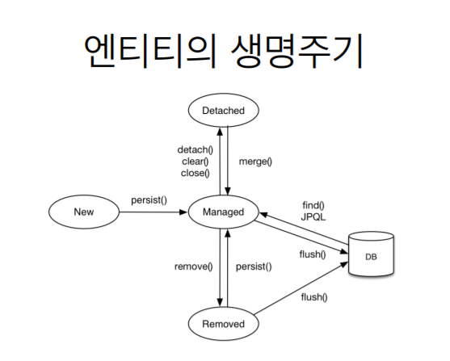


<br><br>


## 2. persist, detach, remove 테스트

```java
package hellojpa;

import javax.persistence.EntityManager;
import javax.persistence.EntityManagerFactory;
import javax.persistence.EntityTransaction;
import javax.persistence.Persistence;

public class JpaMain {
    public static void main(String[] args) {
        
        EntityManagerFactory emf = Persistence.createEntityManagerFactory("hello");
        
        EntityManager em = emf.createEntityManager();

        EntityTransaction tx = em.getTransaction();
        tx.begin();

        try {
            // 비영속
           Member member = new Member();
           member.setId(102L);
           member.setName("HelloJPA");

            // 영속
           System.out.println("=== BEFORE ===");
           em.persist(member); // 이 시점에서는 영속성 컨텍스트 1차 캐시에 저장만 되고, DB에 쿼리는 날리지 않은 상태
           System.out.println("=== AFTER ===");

           tx.commit(); // DB에 쿼리 날리는 시점
        } catch (Exception e) {
            tx.rollback();
        } finally {
           em.close(); 
        }

        emf.close();

    }
}
```

위 코드를 실행해보면

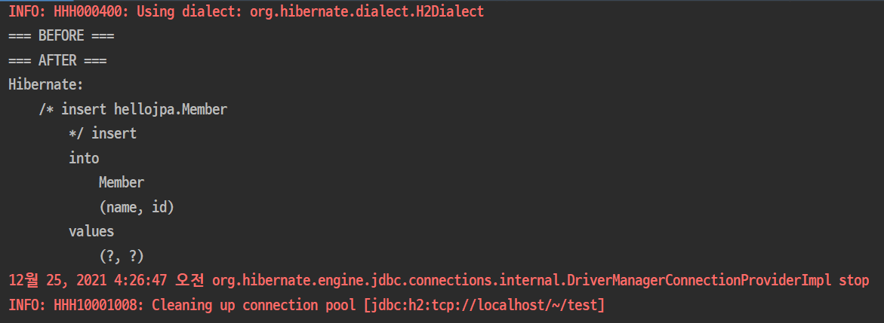

위와 같은 결과를 출력할 수 있다. 이는 `em.persist(member)` 를 실행하는 시점에서는, 영속성 컨텍스트에 저장만되고, 실제로 db에 insert 쿼리를 통해 저장하는 시점은 `tx.commit()` 을 실행하는 시점이라는 것을 알 수가 있다.

```java
em.persist(member);
em.detach(member); // member 객체를 영속성 컨텍스트에서 분리, 준영속 상태
```
```java
em.persist(member);
em.remove(member); // 객체를 삭제한 상태
```
EntityManager의 `detach` 나 `remove` 를 통해 객체를 영속성 컨텍스트에서 분리 혹은 삭제를 시키면, 실제 DB에 commit을 하는 시점에서는 insert문이 실행되지 않는다는 것을 확인 할 수 있다.

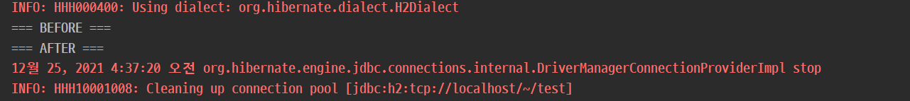


<br><br>


## 3. 영속성 컨텍스트의 이점

1. 1차 캐시
2. 동일성(identity) 보장
3. 트랜잭션을 지원하는 쓰기 지연 (transactional write-behind)
4. 변경 감지(Dirty Checking)
5. 지연 로딩(Lazy Loading)

<br>

### 1) 엔티티 조회, 1차 캐시

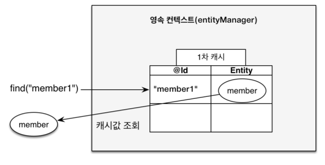

```java
Member member = new Member();
member.setId(103L);
member.setName("HelloJPA");

//1차 캐시에 저장됨
em.persist(member);

//1차 캐시에서 조회
Member findMember = em.find(Member.class, "member1");
System.out.println("findMember.id = " + findMember.getId());
System.out.println("findMember.name = " + findMember.getName());

tx.commit();
```

위 코드를 실행해보면

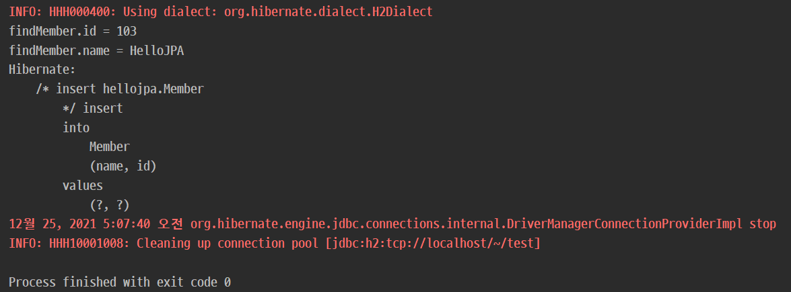

Member를 조회하는 시점에서도 select 쿼리가 실행되지 않는 것을 확인 할 수 있다.   
(DB가 아니라 1차 캐시에서 조회해 왔기 때문)

```java
// em.persist(member);
// Member findMember = em.find(Member.class, 103L);
Member findMember1 = em.find(Member.class, 103L);
Member findMember2 = em.find(Member.class, 103L);

tx.commit();
```

서버를 재실행하고 (EntityManagerFactory, EntityManager 재생성) 위 코드를 실행해보면,

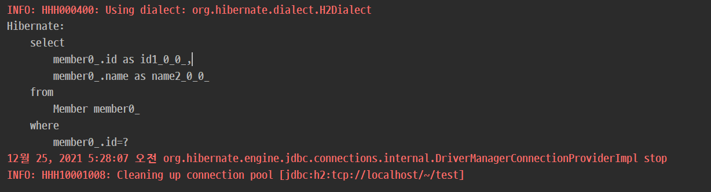

위와 같이 select 쿼리가 1번만 실행된 것을 확인할 수 있는데,  
첫 번째 `em.find` 에서는 1차캐시에 저장된 값이 없기 때문에 DB조회를 했지만,  
두 번째 `em.find` 부터는 1차 캐시에서 조회를 해왔기 때문에 쿼리는 1번만 실행이 된 것이다.

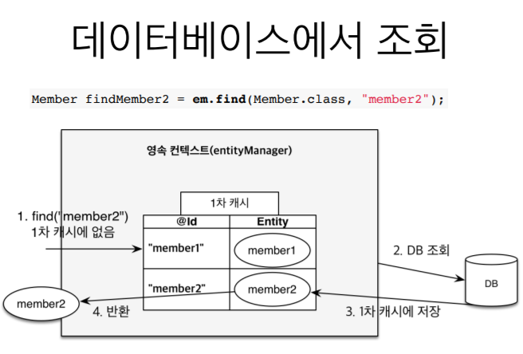

각각 다른 entity를 조회할때도 마찬가지로 1차 캐시에 없으면 DB를 조회한 후 1차 캐시에 저장해두고, 그 이후에 해당 entity를 조회할때는 1차 캐시에서 조회해 오게 된다.

<br>

### 2) 동일성(identity) 보장

```java
Member findMember1 = em.find(Member.class, 103L);
Member findMember2 = em.find(Member.class, 103L);

System.out.println("result = " + (findMember1 == findMember2));

tx.commit();

```

위 코드를 실행해보면,

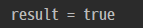

같은 `transaction`에서 `1차캐시`를 통해 조회해 온 객체는 **같은 객체**라는 것을 알 수 있다.

<br>

### 3) 트랜잭션을 지원하는 쓰기 지연 (transactional write-behind)

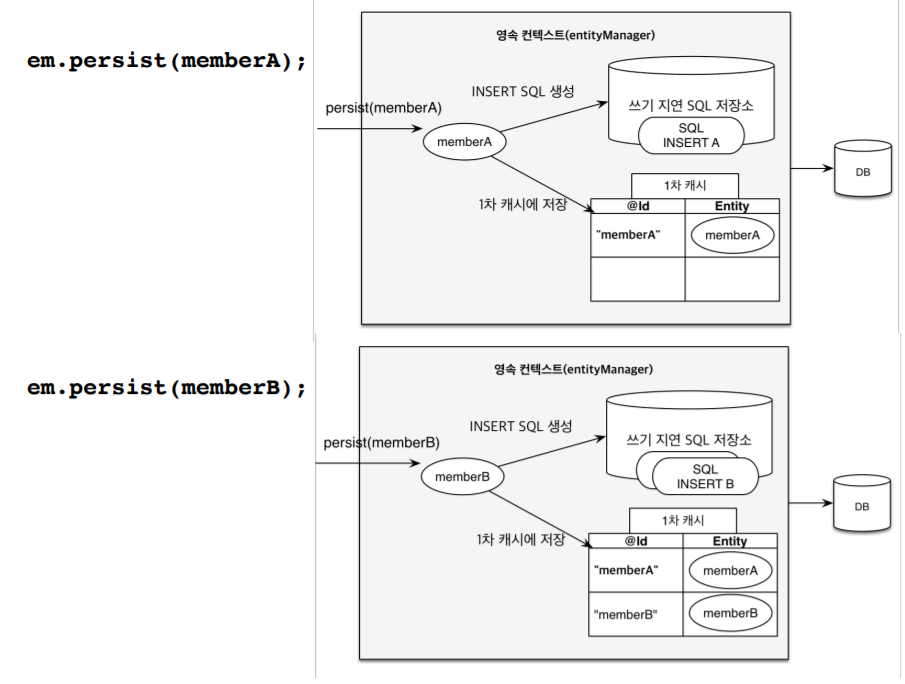

persist를 통해 객체를 영속화 하게 되면, 영속 컨텍스트 1차 캐시에 entity 객체가 key, value 형태로 저장이 된다. 여기서 key는 entity 객체에서 @Id 로 지정한 `primary key` 이며, value는 Entity 객체 자체이다.

그리고, 쓰기 지연 SQL 저장소에도 query가 저장되게 된다.

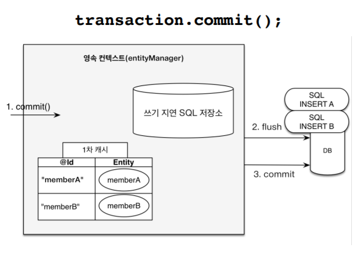

transaction을 commit 하게 되면 그때서야 비로소 `flush` 하게 되며 query들이 실행되어 DB에 반영된다.

<br>

### 4) 변경 감지(Dirty Checking)

```java
Member member = em.find(Member.class, 150L);
member.setName("zzzz");

tx.commit();
```

위 코드를 보면, `find`를 통해 멤버를 조회한 후, 변수에 저장하고, 변수의 set메소드를 통해서 name을 변경하기만 했고, 영속성 컨텍스트에 반영하는 과정을 찾아볼수 없다.

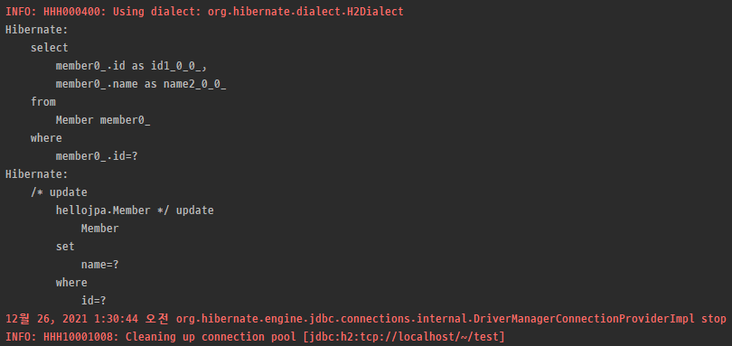

하지만 실행을 하면 `tx.commit()` 시점에 DB에 update 쿼리가 반영되는 것을 확인할 수 있다.

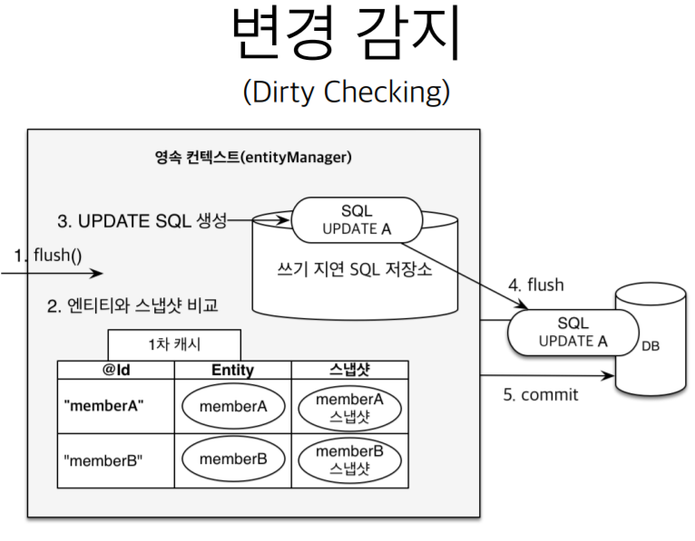

 JPA는 1차 캐시에 해당 엔티티의 초기 상태를 `스냅샷`이라는 형태로 저장해 놓는다. 그리고 commit 시점에 변경된 내용이 있으면 `쓰기 지연 SQL 저장소`에 update 쿼리를 만들고 해당 쿼리를 flush하여 DB에 반영한다.

 삭제의 경우도 같은 메커니즘으로 동작하게 된다.

```java
Member memberB = em.find(Member.class, 160L);
em.remove(memberB);

tx.commit();
```

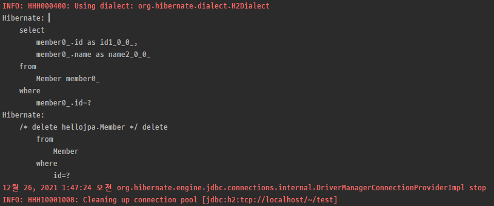


<br><br>


## 4. 플러시(flush)

* 영속성 컨텍스트의 변경내용을 DB에 반영하는 것
* 데이터베이이스 transaction 커밋이 일어나면 자동으로 flush가 발생한다고 보면 된다. 
  * dirtyChecking -> 수정된 entity 쓰기 지연 SQL 저장소에 등록 -> 쓰기 지연 SQL 저장소의 쿼리를 DB에 전송(insert, update, delete)
* 영속성 컨텍스트를 flush 하는 방법
  1. em.flush() - 직접 호출
  2. 트랜잭션 커밋 - flush 자동 호출
  3. JPQL 쿼리 실행 - flush 자동 호출
* flush는 영속성 컨텍스트를 비우는 것이 아니다. (영속성 컨텍스트의 변경내용을 DB에 동기화 하는 것)
* `트랜잭션`이라는 작업 단위가 중요 -> 커밋 직전에만 동기화하면 되는 것.


<br><br>


## 5. 준영속

* 영속 상태의 entity가 영속성 컨텍스트에서 분리되는 것
  *  em.detach(entity) : 특정 엔티티만 준영속 상태로 전환
  *  em.clear() : 영속성 컨텍스트 초기화
  *  em.close() : 영속성 컨텍스트 종료


<br><br>


## 참고
[자바 ORM 표준 JPA 프로그래밍 - 기본편](https://www.inflearn.com/course/ORM-JPA-Basic)