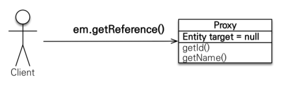
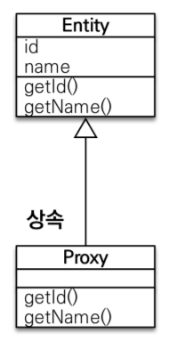
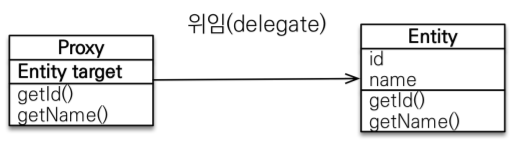
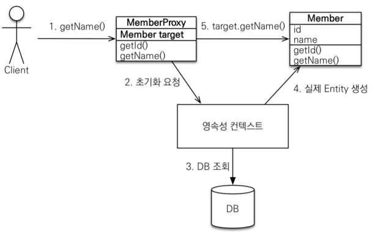
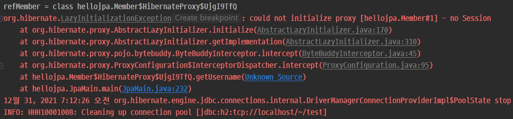

# 프록시

## 1. 프록시 기초
* em.find(): 데이터베이스를 통해서 실제 엔티티 객체 조회
* em.getReference(): 데이터베이스 조회를 미루는 가짜(프록시) 엔티티 객체 조회
    
* 실제 클래스를 상속 받아서 만들어지며, 실제 클래스와 겉 모양이 같다.
* 이론상으로는 사용하는 입장에서는 진짜 객체인지 프록시 객체인지 구분하지 않고 사용하면 됨   
    
* 프록시 객체는 실제 객체의 참조(target)를 보관 (프록시 객체의 멤버변수로 target을 가지고 있다.)
* 프록시 객체를 호출하면 프록시 객체는 실제 객체의 메소드 호출한다.   
    


<br><br>


## 2. 프록시 초기화

```java
Member member = em.getReference(Member.class, “id1”);
member.getName();
```



1. getName() 메소드를 호출하면, MemberProxy객체는 영속성 컨텍스트에 초기화 요청을 한다.
2. 영속성 컨텍스트는 DB를 조회하여, 실제 Entity를 생성하고, Proxy객체의 target에 실제 Entity의 참조값을 넣어준다.
3. proxy객체는 실제 Entity(`Member`)의 실제 메소드(`getName()`) 을 호출하여 값을 받는다.

> proxy객체에 대한 메커니즘은 JPA 표준 스펙에는 언급이 없다. 하이버네이트나 다른 라이브러리들이 구현하기 나름이지만, 기본적으로 이러한 메커니즘으로 동작한다고 알고 있으면 된다


<br><br>


## 3. 프록시의 특징

* 프록시 객체는 처음 사용할 때 한 번만 초기화

* 프록시 객체를 초기화 할 때, 프록시 객체가 실제 엔티티로 바뀌는 것은 아님, 초기화되면 프록시 객체를 통해서 실제 엔티티에 접근 가능

* 프록시 객체는 원본 엔티티를 상속받음, 따라서 타입 체크시 주의해야함 (== 비교 실패, 대신 instance of 사용)
    ```java
    Member member1 = new Member();
    member1.setUsername("member1");
    em.persist(member1);

    Member member2 = new Member();
    member2.setUsername("member2");
    em.persist(member2);

    em.flush();
    em.clear();

    Member m1 = em.find(Member.class, member1.getId());
    Member m2 = em.getReference(Member.class, member2.getId());

    System.out.println("m1 == m2 : " + (m1.getClass() == m2.getClass()));  // 출력결과 : m1 == m2 : false
    System.out.println("m1 == m2 : " + (m1 instanceof Member));  // 출력결과 : m1 == m2 : true
    System.out.println("m1 == m2 : " + (m2 instanceof Member));  // 출력결과 : m1 == m2 : true


    tx.commit();
    ```
* 영속성 컨텍스트에 찾는 엔티티가 이미 있으면 em.getReference()를 호출해도 실제 엔티티 반환

* 영속성 컨텍스트의 도움을 받을 수 없는 준영속 상태일 때, 프록시를 초기화하면 문제 발생   
  (하이버네이트는 org.hibernate.LazyInitializationException 예외를 터트림)
    ```java
    try {
        Member member1 = new Member();
        member1.setUsername("member1");
        em.persist(member1);

        em.flush();
        em.clear();

        Member refMember = em.getReference(Member.class, member1.getId());
        System.out.println("refMember = " + refMember.getClass()); // proxy

        em.detach(refMember);  // 혹은 em.close(); 혹은 em.clear();

        refMember.getUsername();  // 에러발생

        tx.commit();
    } catch (Exception e) {
        tx.rollback();
        e.printStackTrace();
    } finally {
        em.close();
    }
    ```
    

* 번외편
    ```java
    Member member1 = new Member();
    member1.setUsername("member1");
    em.persist(member1);

    em.flush();
    em.clear();

    Member refMember = em.getReference(Member.class, member1.getId());
    System.out.println("refMember = " + refMember.getClass()); 
    // 출력결과 -> refMember = class hellojpa.Member$HibernateProxy$DkhP7QqA

    Member findMember = em.find(Member.class, member1.getId());
    System.out.println("findMember = " + findMember.getClass());  
    // 출력결과 -> findMember = class hellojpa.Member$HibernateProxy$DkhP7QqA
    System.out.println("refMember == findMember : " + (refMember == findMember));  
    // 출력결과 -> refMember == findMember : true

    // 결과가 true 이고 refMember 와 findMember 가 같은 proxy로 반환되는 이유는
    // JPA에서는 같은 영속성 컨텍스트(같은 트랜잭션) 안에서 같은 객체의 `==` 비교시 true를 보장해야 하기 때문

    tx.commit();
    ```


<br><br>


## 4. 프록시 확인
* 프록시 인스턴스의 초기화 여부 확인   
PersistenceUnitUtil.isLoaded(Object entity)

* 프록시 클래스 확인 방법   
entity.getClass().getName() 출력(..javasist.. or HibernateProxy…)

* 프록시 강제 초기화   
org.hibernate.Hibernate.initialize(entity);

* 참고: JPA 표준은 강제 초기화 없음   
강제 호출: member.getName()

```java
Member member1 = new Member();
member1.setUsername("member1");
em.persist(member1);

em.flush();
em.clear();

Member refMember = em.getReference(Member.class, member1.getId());
System.out.println("refMember = " + refMember.getClass());  
// 출력결과 -> refMember = class hellojpa.Member$HibernateProxy$ixJ7bSYG

System.out.println("isLoaded = " + emf.getPersistenceUnitUtil().isLoaded(refMember));  
// 출력결과 -> isLoaded = false
Hibernate.initialize(refMember);  // 강제초기화
System.out.println("isLoaded = " + emf.getPersistenceUnitUtil().isLoaded(refMember));  
// 출력결과 -> isLoaded = true

tx.commit();
```


<br><br>


## 참고
[자바 ORM 표준 JPA 프로그래밍 - 기본편](https://www.inflearn.com/course/ORM-JPA-Basic)