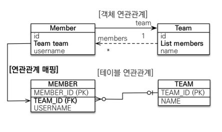
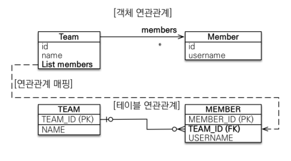
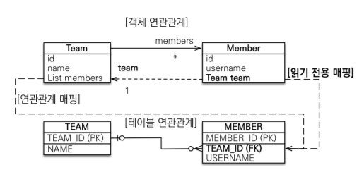
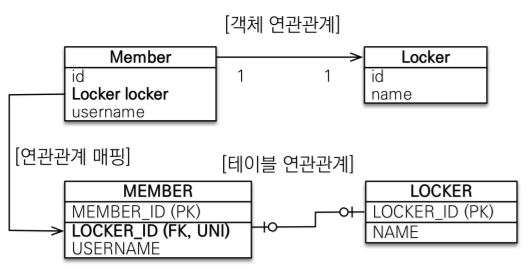
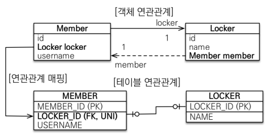
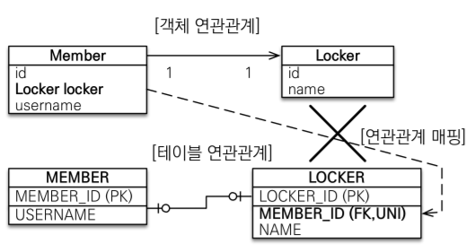
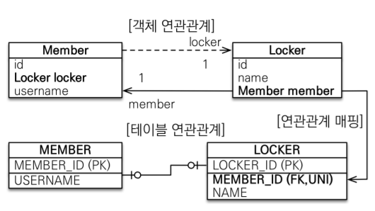
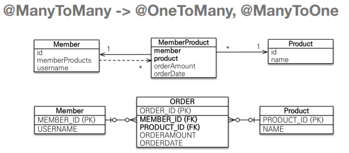

# 다양한 연관관계 매핑

## 연관관계 매핑시 고려사항 3가지
  1) 다중성
     * 다대일: @ManyToOne
     * 일대일: @OneToOne
     * 일대다: @OneToMany
     * 다대다: @ManyToMany
  2) 단방향,양방향
     * 테이블
       * 외래 키 하나로 양쪽 조인 가능
       * 사실 방향이라는 개념이 없음
     * 객체
       * 참조용 필드가 있는 쪽으로만 참조 가능
       * 한쪽만 참조하면 단방향
       * 양쪽이 서로 참조하면 양방향
  3) 연관관계의 주인
     * 테이블은 외래 키 하나로 두 테이블이 연관관계를 맺음
     * 객체 양방향 관계는 A->B, B->A 처럼 참조가 2군데
     * 객체 양방향 관계는 참조가 2군데 있음. 둘중 테이블의 외래 키를 관리할 곳을 지정해야함
     * 연관관계의 주인: 외래 키를 관리하는 참조
     * 주인의 반대편: 외래 키에 영향을 주지 않음, 단순 조회만 가능

  

## 1. 다대일 [N:1]
* 가장 많이 사용하는 연관관계
* 다대일의 반대는 일대다
* 다대일 양방향 정리   
    
  * 외래 키가 있는 쪽이 연관관계의 주인
  * 양쪽을 서로 참조하도록 개발

  

## 2. 일대다 [1:N]

1. 일대다 단방향 정리   
    
   * 일대다 단방향은 일대다(1:N)에서 일(1)이 연관관계의 주인
   * 테이블 일대다 관계는 항상 다(N) 쪽에 외래 키가 있음
   * 객체와 테이블의 차이 때문에 반대편 테이블의 외래 키를 관리하는 특이한 구조
   * @JoinColumn을 꼭 사용해야 함. 그렇지 않으면 조인 테이블 방식을 사용함(중간에 테이블을 하나 추가함)
   * 일대다 단방향 매핑의 단점
     * 엔티티가 관리하는 외래 키가 다른 테이블에 있음
     * 연관관계 관리를 위해 추가로 UPDATE SQL 실행
   * 일대다 단방향 매핑보다는 다대일 양방향 매핑을 사용하자

2. 일대다 양방향 정리   
    
   * 이런 매핑은 공식적으로 존재X
   * @JoinColumn(insertable=false, updatable=false)
   * 읽기 전용 필드를 사용해서 양방향 처럼 사용하는 방법
   * 다대일 양방향을 사용하자

  

## 3. 일대일 [1:1]

* 일대일 관계는 그 반대도 일대일
* 주 테이블이나 대상 테이블 중에 외래 키 선택 가능
* 주 테이블에 외래 키
* 대상 테이블에 외래 키
* 외래 키에 데이터베이스 유니크(UNI) 제약조건 추가

 

### 1) 일대일: 주 테이블에 외래 키 단방향 정리

* 다대일(@ManyToOne) 단방향 매핑과 유사

 

### 2) 일대일: 주 테이블에 외래 키 양방향 정리

* 다대일 양방향 매핑 처럼 외래 키가 있는 곳이 연관관계의 주인
* 반대편은 mappedBy 적용

 

### 3) 일대일: 대상 테이블에 외래 키 단방향 정리

* 단방향 관계는 JPA 지원X
* 양방향 관계는 지원

 

### 4) 일대일: 대상 테이블에 외래 키 양방향

* 사실 일대일 주 테이블에 외래 키 양방향과 매핑 방법은 같음

 

### 일대일 정리
* 주 테이블에 외래 키
  * 주 객체가 대상 객체의 참조를 가지는 것 처럼 주 테이블에 외래 키를 두고 대상 테이블을 찾음
  * 객체지향 개발자 선호
  * JPA 매핑 편리
  * 장점: 주 테이블만 조회해도 대상 테이블에 데이터가 있는지 확인 가능
  * 단점: 값이 없으면 외래 키에 null 허용
* 대상 테이블에 외래 키
  * 대상 테이블에 외래 키가 존재
  * 전통적인 데이터베이스 개발자 선호
  * 장점: 주 테이블과 대상 테이블을 일대일에서 일대다 관계로 변경할 때 테이블 구조 유지
  * 단점: 프록시 기능의 한계로 지연 로딩으로 설정해도 항상 즉시 로딩됨

  

## 4. 다대다 [N:M]
* 관계형 데이터베이스는 정규화된 테이블 2개로 다대다 관계를 표현할 수 없음   
  (객체 연관관계로는 컬렉션을 사용해서 객체2개로 다대다 관계가 가능하다)
* 다대다 매핑의 한계
  * 편리해 보이지만 실무에서 사용하기에는 문제가 많다
  * 실무에서는 연결 테이블이 단순히 연결만 하고 끝나는게 아니라, 주문시간,수량 같은 데이터가 계속 들어올 수가 있다. 하지만 JPA에서 만들어주는 연결 테이블로는 해당 데이터를 처리하기가 힘들다.
  * 다대다 한계 극복 : 연결 테이블용 엔티티 추가(연결 테이블을 엔티티로 승격) 
    

  

## 참고
[자바 ORM 표준 JPA 프로그래밍 - 기본편](https://www.inflearn.com/course/ORM-JPA-Basic)