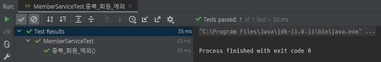

# assertThrows로 예외 처리를 테스트 방법 (JUNIT 5)
[스프링 입문 - 코드로 배우는 스프링 부트, 웹 MVC, DB 접근 기술](https://www.inflearn.com/course/%EC%8A%A4%ED%94%84%EB%A7%81-%EC%9E%85%EB%AC%B8-%EC%8A%A4%ED%94%84%EB%A7%81%EB%B6%80%ED%8A%B8) 를 학습하는 도중에 나온 테스트 방법 기록

~~~java
@Test
public void 중복_회원_예외() {
    // given
    Member member1 = new Member();
    member1.setName("spring");

    Member member2 = new Member();
    member2.setName("spring");

    // when
    memberService.join(member1);

    try {
        memberService.join(member);
        fail();
    } catch (IllegalStateException e) {
        System.out.println("IllegalStateException 예외 발생");
        assertThat(e.getMessage()).isEqualTo("회원 중복 발생");
    }
}
~~~

try catch 문으로 처리하기에는 코드가 길어지고, 가독성이 떨어진다. 
이떄, org.junit.jupiter.api.Assertions 에서 제공하는 assertThrows 문을 사용하여, 예외를 검증할 수 있다.

~~~java
IllegalStateException e = assertThrows(IllegalStateException.class, () -> memberService.join(member2));
assertThat(e.getMessage()).isEqualTo("이미 존재하는 회원입니다.");
~~~
assertThrows 문으로 try catch문을 대체한다. 첫번째 parameter로 예외class를, 두번째 parameter에 람다식을 활용하여 메소드를 넘겨준다.

테스트 메소드 실행시 정상적으로 IllegalStateException 이 터지는 것을 검증할 수 있었다.